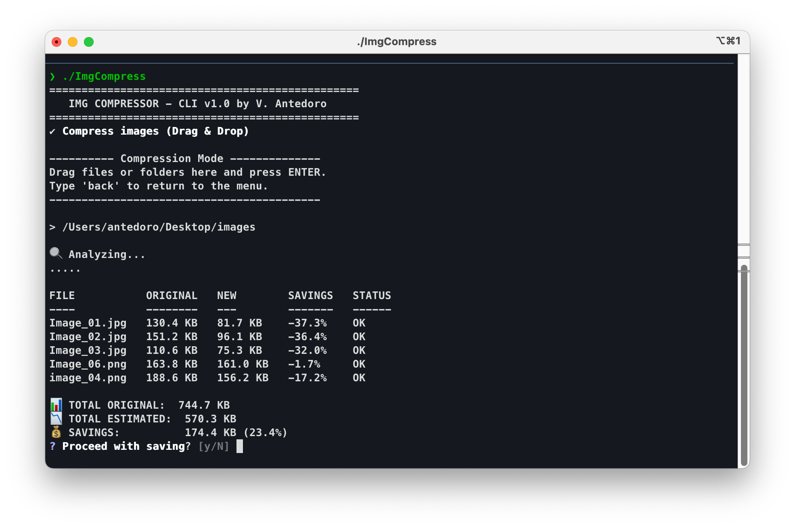

# ImgCompress-go

**ImgCompress-go** is a lightweight and powerful desktop application to optimize, resize, and convert images (JPEG, PNG). Written in Go, it features an interactive Command Line Interface (CLI) and supports native Drag & Drop.



## ✨ Features

*   **Smart Compression:** Reduces image file size while maintaining high visual quality.
*   **Resizing:** Set a maximum width (e.g., 1920px) and the app will downscale larger images proportionally.
*   **Conversion:** Easily convert from PNG to JPG (or vice-versa) or keep the original format.
*   **Drag & Drop:** Drag files or entire folders onto the app icon or into the window.
*   **Pre-save Analysis:** See exactly how much space you will save *before* confirming the operation.
*   **Persistent Config:** Your preferences are automatically saved across sessions.

## 🚀 Installation & Usage

### macOS
1.  Download the `ImgCompress_Silicon.app` (for M1/M2/M3) or `ImgCompress_Intel.app` (for older Macs).
2.  Drag it to your **Applications** folder (or keep it on your Desktop).
3.  **Usage:**
    *   **Drag & Drop:** Drag images directly onto the app icon.
    *   **Interactive Mode:** Double-click the app to configure parameters (Quality, Format, Resize) via the interactive menu.

### Windows
1.  Download `ImgCompress_Win_x64.exe` or  `ImgCompress_Win_ARM64.exe` .
2.  Run the file from the Command Prompt or via double-click.

## 🛠 Building from source

To build the project yourself:

### Prerequisites
*   [Go](https://go.dev/dl/) (v1.21+) installed.

### Commands

1.  Clone the repository:
    ```bash
    git clone https://github.com/your-username/imgcompress-go.git
    cd imgcompress-go
    ```

2.  Install dependencies:
    ```bash
    go mod tidy
    ```

3.  **Build for macOS:**
    ```bash
    chmod +x build_mac.sh
    ./build_mac.sh
    ```
    You will find the `.app` bundles in the root folder.

4.  **Build for Windows:**
    ```bash
    chmod +x build_win.sh
    ./build_win.sh
    ```
    You will find the executables in the `dist/` folder.

## ⚙️ Configuration

Settings are stored in:
*   **macOS:** `~/Library/Application Support/ImgCompress/config.json`
*   **Windows:** `%AppData%\ImgCompress\config.json`

Example config:
```json
{
  "jpeg_quality": 75,
  "output_format": "original",
  "max_width": 1920
}
```

## 📝 License

Distributed under the MIT License. See `LICENSE` for more information.